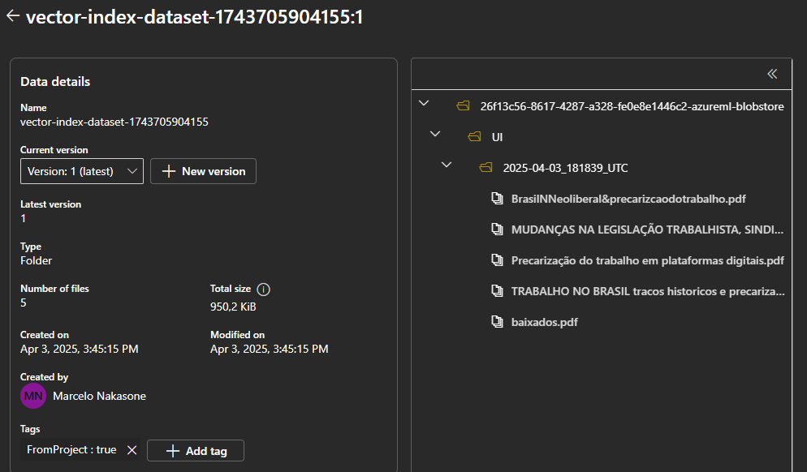
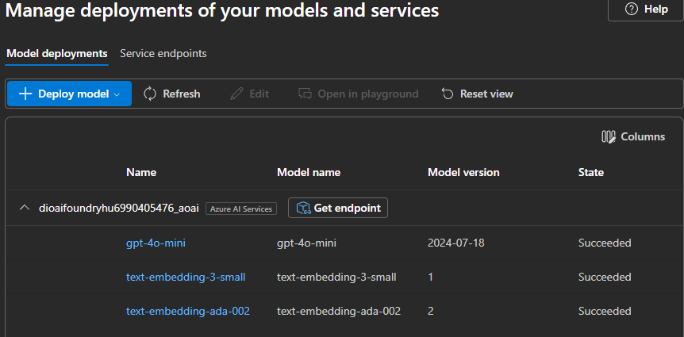
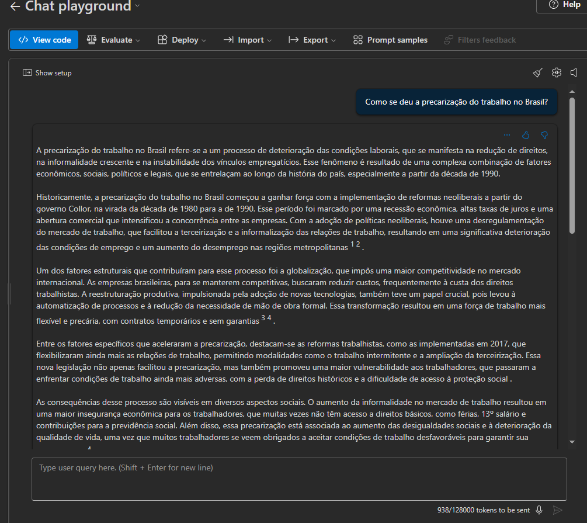
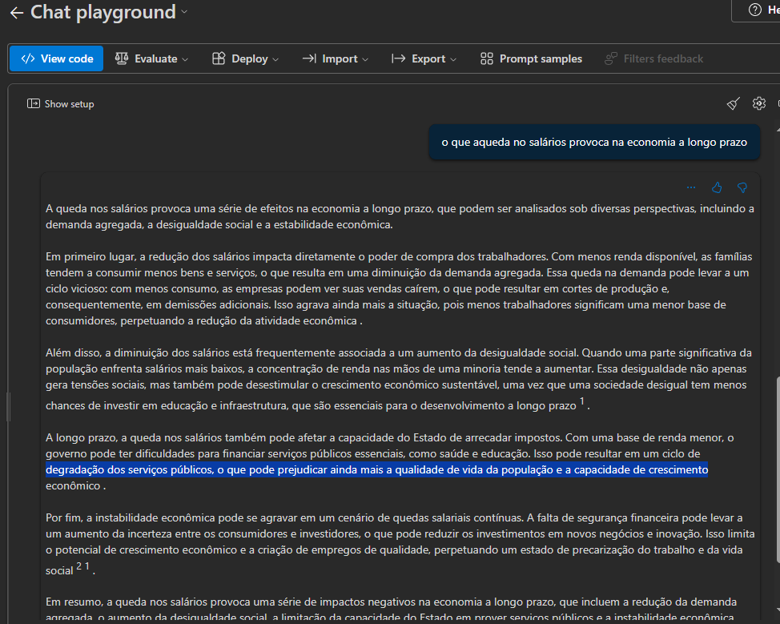
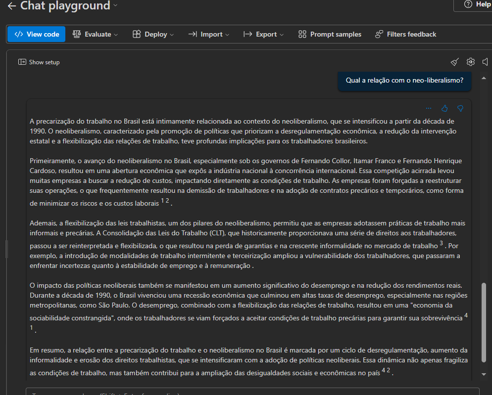

Desafio - Criando um Chatbot Baseado em Conteúdo de PDFs 

Este é um laboratório de chat interativo desenvolvido com base nas aulas do Bootcamp Microsoft Certification Challenge #3 DP-100

Cenário

Imagine que você é um estudante de Engenharia de Software, prestes a escrever seu Trabalho de Conclusão de Curso (TCC). Para isso, você precisa revisar e correlacionar diversos artigos científicos. Entretanto, à medida que acumula mais documentos, torna-se cada vez mais difícil extrair informações relevantes e conectar ideias entre diferentes textos.

Diante desse desafio, você decide utilizar inteligência artificial para facilitar esse processo, criando um sistema de busca inteligente capaz de interpretar os PDFs, organizar informações e gerar respostas relevantes com base no conteúdo carregado.

Artigos cientificos

Foi escolhido como tema a "Precarização do trabalho no Brasil" onde foi feito o upload dos arquivos relacionados para indexação conforme a seguinte figura.

Criação dos endpoints

Foram selecionados os modelos gpt-4o mini (LLM), o text-embedding-3 small e o text-embedding-ada-002 conforme a seguinte figura.

Testes do chat no Chat playground.

Foram feitos os testes com base nas perguntas:

- Como se deu a precarização do trabalho no Brasil?

- O que aqueda no salários provoca na economia a longo prazo?

- Qual a relação com o neo-liberalismo?

